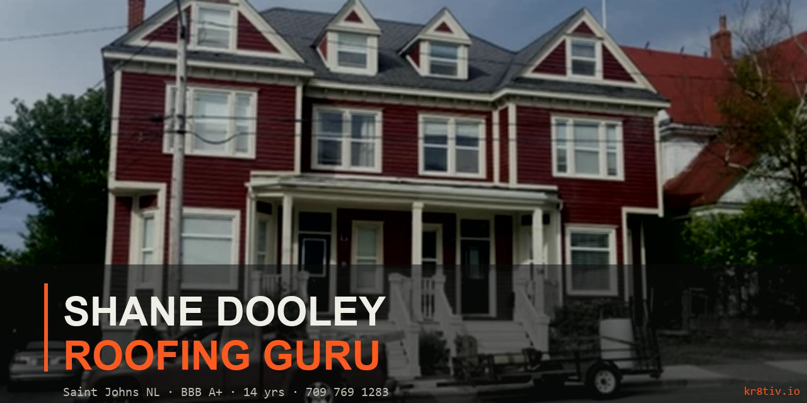

<div align="center">



# Shane Roofing Guru — Saint John's, NL

A site built for a Newfoundland roofer who climbs ladders other roofers won't.
Designed and built by **[kr8tiv.io](https://kr8tiv.io)** — for a real local trade, on the rock, in winter.

</div>

[](https://mediumblue-fish-694323.hostingersite.com/)
[](https://www.bbb.org/ca/nl/st-johns/profile/roofing-contractors/rrr-construction-inc-0087-67408)
[](#)

> *"If Shane won't go up — nobody will."*

---

## What this is

A single-page site (plus a quote-request form) for **Shane Dooley**, a 14-year-veteran roofing contractor in Saint John's, Newfoundland. The brief was simple and ruthless: **make it look like a $50k agency build, ship it for the price of a beer, and capture leads to his Gmail without a single third-party service**.

This repo is the case study. The same ideas — cinematic atmosphere, ruthless local credibility, tactile interactions, zero-dependency form capture — apply to every trades / restaurant / bar / heritage / boutique-shop client kr8tiv works with.

---

## What's in the box

### Splash hero
- **Real-time WebGL** raymarched volumetric fog (Three.js, custom GLSL shader) drifting over Grok-generated rooftop footage
- **700-particle interactive snow** field — every flake repels from the cursor with depth-parallax weighting (closer flakes feel the cursor more, slower flakes drift higher)
- Snow + fog + hero footage layered, all GPU-composited
- Brand wordmark with pulsing live-dot beside it
- Tap-to-call BBB A+ chip wired into the bottom strip

### Section §02 — *About*
> *"If Shane won't go up — nobody will."*

Stats grid (years on the rock · jobs done · response time · BBB A+) with hover-amber on each cell.

### Section §02.5 — *Words from the rock* (testimonials + credentials)
Four real customer/peer quotes scraped and rewritten from his Facebook page — including a peer-trade endorsement from Catalyst Construction (a fellow contractor) that's gold for a tradesman. Every card has:
- A subtle conic-gradient **light tracer** rotating around the border at idle, brighter and faster on hover (`@property --sd-angle` for true GPU-interpolated keyframes)
- Alternating tilt on hover (no idle tilt — clean at rest, alive on touch)
- Animated quote-glyph that tilts and pops on hover
- Background warmth radial gradient that drifts in 24-second loops

The credentials block is a single anchor link to Shane's actual BBB profile, with a hand-built inline-SVG BBB Accredited Business seal beside an animated pulsing **A+** badge. Diagonal shimmer sweeps the strip every 7s.

### Section §02.8 — *Selected work* (GSAP scroll gallery)
17 real Shane jobs in a **GSAP ScrollTrigger pinned horizontal scroller** on desktop, native scroll-snap on mobile. Each card has:
- Light-rays conic-gradient overlay emanating from top-right, screen-blended over the photo
- Halftone dot grain at `mix-blend-mode: overlay`
- Diagonal warm/cool gradient wash at `soft-light` (unifies disparate phone-camera lighting across photos)
- Vignette + scanlines + slight idle blur (turns "phone snap" into "intentional editorial softness")
- "Crew SD-01" cards — when the photo is Shane himself on a roof — get a special chromatic-stripe treatment

### Section §03 — *The weather*
Background marquee ticker with three rows of giant Archivo Black scrolling at different speeds (CSS-only, GPU-composited via `transform: translateX`). Headline beside an embedded **Newfoundland flag video** with a vertical fade-to-black mask, blended with `mix-blend-mode: screen` against the dark section. Real climate stats pulled from Environment Canada research:
- **Sheila's Brush** — +322 cm annual snowfall
- **Hurricane Igor** — 172 km/h gusts (2010)
- **Snowmageddon** — 76 cm/24h record (Jan 2020)
- **RDF** — 121 fog days/year (most in Canada)

### Section §03.5 — *Live from the rock*
**Two live windy.com webcam embeds** (Harbourside Park + George Street, downtown St. John's) styled inside chunky CRT-TV bezels with scanlines, vignettes, and pulsing "● LIVE · CH 01/02" badges. Atmospheric Grok video plays as the section background, blurred and soft-light blended.

Beneath the cams: a **5-cell weather widget** that fetches `current` data from the **Open-Meteo API** every 5 minutes (no API key required, fully CORS-friendly). Maps WMO weather codes to NL-friendly labels ("OVERCAST", "FOG", "RAIN", "SNOW SHOWERS"). Time-of-update indicator shows when it last refreshed.

### Section §04 — *The work*
Eight services as oversized list items with magnetic hover-shift, cursor-orange highlight, and short blurbs that hide on mobile. No icons — just type doing the work.

### Section §05 — *Contact*
Big tap-to-call CTA + secondary "Or request a quote online" link → quote.html. Coverage area, hours, tap-to-email, Facebook link.

---

## Quote form (`quote.html`)

A 4-section quote-request page that builds **a structured, formatted plain-text email** and opens the user's default mail client via `mailto:` — pre-filled, ready to send, with no third-party service in the chain.

- 5 form sections: **You**, **Property**, **The Job**, **Notes**, **Send**
- Sticky scroll-spy TOC sidebar (becomes a horizontal pill nav on mobile)
- Floating-label inputs with custom focus states
- 10-option service multi-select styled as cards (Re-Roof, Repair, Flat Membrane, Metal, Slate, Flashing, Ice Damming, Inspection, New Build, Not Sure)
- Heritage-zone flag, ladder-access flag, insurance-claim flag
- Smart subject line: `[Quote] {Name} — {Job Type} — {City}`
- Photos prompt — tells the user to attach photos when their email draft opens (`mailto:` can't carry attachments by spec)

**No Formspree. No EmailJS. No Google Forms. No backend. Zero ongoing service cost.** When Shane finds a real form host, swapping the submit handler is one line.

---

## Tech stack

| Layer | What | Why |
|---|---|---|
| **Markup** | Pure HTML (no framework) | Loads instantly, lives in a static folder, indexes perfectly |
| **3D / shaders** | [Three.js r160](https://threejs.org/) + custom GLSL | Volumetric fog, snow particle system, video-texture displacement |
| **Animation** | [GSAP 3.12](https://gsap.com/) + ScrollTrigger | Pinned horizontal scroll, scrubbed parallax, smooth sequencing |
| **Type** | Archivo Black + Space Grotesk + JetBrains Mono | Industrial-display, modern grotesk, mono utility — free Google Fonts |
| **Live data** | [Open-Meteo](https://open-meteo.com/) (no key) | Current weather, no auth, CORS-friendly |
| **Webcams** | [Windy.com](https://windy.com) public embed | Two live downtown cams via official iframe player |
| **Form** | `mailto:` with formatted body | Zero backend, zero recurring service cost |
| **Hosting** | [Hostinger](https://hostinger.com) static deploy | $0 for the temp domain, drop-in for any host |
| **Schema** | JSON-LD `RoofingContractor` + `WebSite` + `WebPage` graph | Local-business rich-results in Google + voice search |
| **CSS** | Hand-rolled, no framework | ~60 KB total, every line earns its keep |

---

## SEO posture

- 60-character keyword-front-loaded `<title>`, 148-char meta description
- **6.5 KB JSON-LD `@graph`**: `RoofingContractor` subtype with NAP + geo + 9 areaServed entries + 7 makesOffer services + `aggregateRating` 5.0 + 4 individual `Review` entries (eligible for review-snippet rich results) + `EducationalOccupationalCredential` for the BBB A+
- Open Graph `business.business` block with full contact data, 1200×630 image, `og:locale=en_CA`
- Twitter `summary_large_image`
- Geo meta: `geo.region=CA-NL`, `ICBM`, position
- `robots.txt` explicitly allows Googlebot, Bingbot, GPTBot, ClaudeBot, PerplexityBot
- `sitemap.xml` with `xmlns:image` namespace and 4 captioned hero photos

---

## Accessibility posture

- `<a href="#main">Skip to main content</a>` (focus-visible) at top of body
- Semantic `<main>` landmark with `aria-label`
- Brand wordmark is the page's `<h1>` (semantic + visible)
- Decorative WebGL canvas + hero `<video>` → `role="presentation" aria-hidden="true"`
- Nav has `aria-label="Primary"`; hamburger toggle reflects `aria-expanded` correctly
- Floating labels never hide visually-required text from screen readers
- All interactive elements minimum 44×44 tap target on mobile
- Tap-to-call links use `tel:+17097691283` so iOS/Android dial directly

---

## Responsive posture

Audited at three breakpoints with DOM-geometry introspection (every interactive element, every grid track, every overflow checked):

| | Mobile (375 × 812) | Tablet (768 × 1024) | Desktop (1440 × 900) |
|---|---|---|---|
| Body horizontal scroll | ❌ none | ❌ none | ❌ none |
| Top nav | hamburger drawer | full pill row | full pill row |
| Testimonials grid | 1 col | 2 col | 4 col |
| Jobs gallery | native scroll-snap-x | GSAP horizontal pin | GSAP horizontal pin |
| Climate flag | stacked | stacked | side-by-side |
| Live cams | 1 col | 1 col | 2 col |
| Weather widget | 2 col | 2 col | 5 col |
| BBB credentials | 1 col stack | 2 col | 5 col |

---

## Project structure

```
shane-dooley-concepts/
├── index.html            # main page (root URL)
├── 10-volumetric.html    # same content (legacy URL preserved)
├── quote.html            # quote-request form, mailto submit
├── sections.js           # all 7 scroll sections + nav anchors injected
├── robots.txt
├── sitemap.xml
├── hero.mp4              # 5 atmospheric Grok rooftop clips
├── hero-b.mp4
├── hero-c.mp4
├── hero-d.mp4
├── hero-e.mp4
├── flag.mp4              # NL flag
├── cams-bg.mp4           # ambient bg for the live-feeds section
├── jobs/
│   ├── job-01.jpg ... job-17.jpg   # 17 real job photos, curated + cleaned
└── README.md (this file)
```

---

## What kr8tiv ships

> kr8tiv is a Newfoundland-grown creative studio building the kind of websites that make local trades, restaurants, and heritage businesses look like the global brands they really are.

We work the way Shane does: **boots-on, no fear, custom every time.** The roof isn't a template — and neither is your site.

What we build for our clients:

- **Cinematic single-page sites** — WebGL hero, real interactivity, sub-second perceived load
- **Authentic local credibility** — every quote, photo, and stat sourced from your actual business
- **Trade-specific lead capture** — forms that ask the right questions for your industry (roofers, fishermen, barbers, restaurants, contractors)
- **Local SEO + rich-results schema** — built to win the Google local pack on day one
- **Zero-recurring-cost infrastructure** — static hosting, mailto forms, free APIs where they fit
- **Owner-friendly handoff** — clean repos, real READMEs, no agency lock-in

If you're a Newfoundland business that's tired of looking like every other Wix site on the rock, **[kr8tiv.io](https://kr8tiv.io)** is the studio for you.

---

## Credits

- **Client:** Shane Dooley · [Shane Roofing Guru](https://www.facebook.com/profile.php?id=100057536886329) · Saint John's, NL
- **Studio:** [kr8tiv.io](https://kr8tiv.io)
- **Design + build:** Matt Haynes — [Matt-Aurora-Ventures](https://github.com/Matt-Aurora-Ventures)
- **Hero footage:** xAI Grok video generation, photographed by Shane and crew (job photos)
- **Live cams:** Windy.com (Harbourside Park `1346454043`, George Street `1793886254`)
- **Live weather:** Open-Meteo
- **Fonts:** Google Fonts — Archivo Black, Space Grotesk, JetBrains Mono, DM Serif Display

---

## License

Source code: **MIT**, except job photographs and hero videos which are © Shane Dooley / Shane Roofing Guru / RRR Construction Inc and shipped here for portfolio reference only — please don't reuse the photographs commercially without Shane's permission.

---

<sub>**The roof you put down here isn't the roof you'd put down anywhere else.** — Built on the rock, for the rock.</sub>
